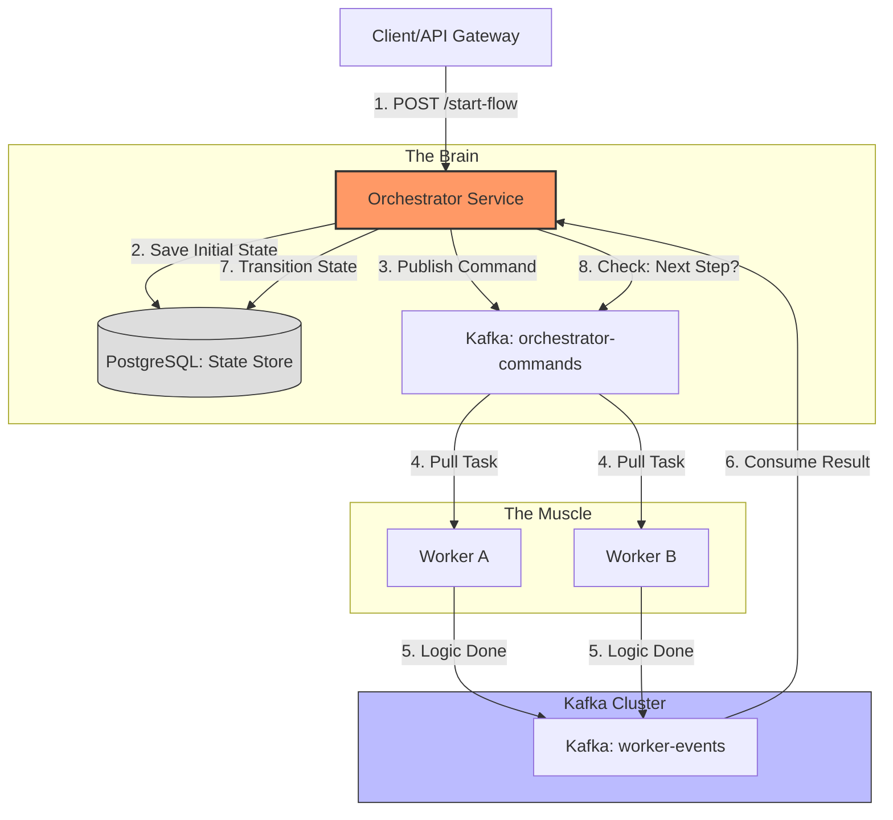

This PRD covers the creation of a **Custom Event-Driven Orchestration Engine**. We will move away from specific business logic (like "Email") and focus on building the **platform** that allows you to plug in any task.

---

# PRD: Generic Event-Driven Orchestration Engine (EDOE)

## 1. Objective

To build a lightweight, Java-based orchestration system that manages long-running processes using an event-driven "Choreography" pattern. The system must ensure that tasks are executed in a specific order, handle failures gracefully, and maintain a persistent record of all process states.

## 2. System Components

1. **The Orchestrator:** The "Brain" that manages the state machine and transitions.
2. **The State Store:** A relational database (PostgreSQL) to track process instances.
3. **The Event Bus:** Kafka topics for `Commands` (outbound) and `Events` (inbound).
4. **The Worker (Template):** A generic interface for services to consume and finish tasks.

---

## 3. Functional Requirements

* **FR1: Process Definition:** Ability to define a sequence of steps in code (e.g., Step A $\rightarrow$ Step B).
* **FR2: Correlation:** Every message must carry a `processId` to link events back to the correct instance.
* **FR3: Idempotency:** The engine must ignore duplicate "Finish" events for the same step.
* **FR4: Persistence:** Every state transition must be written to the DB before the next command is sent.
* **FR5: Error Handling:** Ability to detect a "Failed" event and stop the process or trigger a rollback.

---

## 4. Technical Architecture (Generic)

### Data Schema: `process_instances`

| Field | Type | Description |
| --- | --- | --- |
| `id` | UUID | Primary Key (Process Instance ID) |
| `definition_name` | String | Name of the flow (e.g., "USER_REGISTRATION") |
| `current_step` | String | Current active task |
| `context_data` | JSONB | The "Input/Output" payload accumulated so far |
| `status` | Enum | `RUNNING`, `COMPLETED`, `FAILED`, `SUSPENDED` |

---

## 5. Implementation To-Do List

### Phase 1: Infrastructure & Setup

* [x] **Docker Setup:** Create `docker-compose.yml` with Kafka (KRaft) and PostgreSQL.
* [x] **Spring Project:** Initialize Spring Boot with `Spring Kafka` and `Spring Data JPA`.
* [x] **Topic Creation:** Define two main topics: `orchestrator-commands` and `worker-events`.

### Phase 2: The Core Engine (Orchestrator)

* [x] **State Entity:** Create the `ProcessInstance` JPA entity.
* [x] **Transition Logic:** Write a `TransitionService` that takes a `ProcessID + Event` and determines the next `Command`.
* [x] **Event Consumer:** Implement a Kafka Listener that waits for `WorkerFinishedEvent`.
* [x] **Command Producer:** Implement a service to push JSON envelopes to the `orchestrator-commands` topic.

### Phase 3: The Worker (Task Executor)

* [x] **Worker Listener:** Create a generic listener that filters Kafka messages by "Task Type."
* [x] **Business Logic Placeholder:** A simple Java method that simulates work (e.g., `Thread.sleep(1000)`).
* [x] **Callback Logic:** The worker must wrap its result in an `Event` envelope and send it back.

### Phase 4: Reliability & Monitoring

* [x] **Logging:** Implement Slf4j logging for every state change for "Audit Trails."
* [x] **Error Handling:** Create a `Dead Letter Queue (DLQ)` configuration for failed Kafka messages.
* [x] **API Endpoint:** Create a `GET /status/{id}` endpoint to query the Postgres table.

---

## 6. The "Generic" Flow Logic

1. **API** $\rightarrow$ Orchestrator: "Start User Flow"
2. **Orchestrator** $\rightarrow$ DB: Insert `status=RUNNING`, `step=STEP_1`.
3. **Orchestrator** $\rightarrow$ Kafka: `{"type": "STEP_1", "pid": "123", "data": {...}}`
4. **Worker** $\rightarrow$ Logic: Does the work.
5. **Worker** $\rightarrow$ Kafka: `{"type": "STEP_1_FINISHED", "pid": "123", "output": {...}}`
6. **Orchestrator** $\rightarrow$ DB: Update `step=STEP_2`, merge `output` into `context_data`.
7. **Repeat** until final step.

---

## 7. Next Step

This PRD gives you the roadmap. **Would you like me to provide the Java code for the `ProcessInstance` entity and the `TransitionService` logic to get Phase 2 started?**

### Generic Event-Driven Architecture Map

---

### Expanded To-Do List (Architectural Focus)

To ensure this graph functions as intended, add these specific technical tasks to your **Phase 2 (Orchestrator)**:

* **[x] State Machine Definition:** Create a `Map<String, String>` or a Config file that defines: `IF step X completes -> THEN start step Y`.
* **[x] Transactional Messaging:** Ensure the Database update and Kafka publish happen in one transaction (use the **Transactional Outbox Pattern** if you want to be 100% fail-safe).
* **[x] Correlation ID Header:** Configure your Kafka Template to automatically inject the `processId` into the Kafka Record Headers so workers don't have to parse the JSON body just to find the ID.
* **[x] Step-Level Timeouts:** Implement a scheduled task in Java that scans the `process_instances` table for steps that have been "RUNNING" for more than $N$ minutes and flags them as `STALLED`.

**Shall we move to the code implementation for the `TransitionService` which acts as the logic router for that "Step 8" in the diagram?**