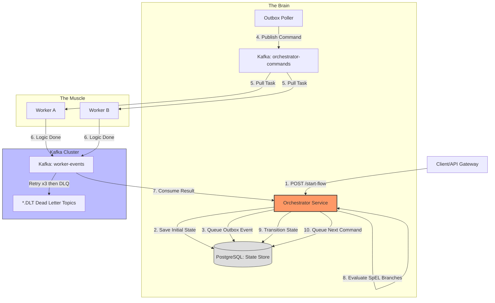

This PRD covers the creation of a **Custom Event-Driven Orchestration Engine**. We will move away from specific business logic (like "Email") and focus on building the **platform** that allows you to plug in any task.

---

# PRD: Generic Event-Driven Orchestration Engine (EDOE)

## 1. Objective

To build a lightweight, Java-based orchestration system that manages long-running processes using an event-driven "Choreography" pattern. The system must ensure that tasks are executed in a specific order, handle failures gracefully, and maintain a persistent record of all process states.

## 2. System Components

1. **The Orchestrator:** The "Brain" that manages the state machine and transitions.
2. **The State Store:** A relational database (PostgreSQL) to track process instances.
3. **The Event Bus:** Kafka topics for `Commands` (outbound) and `Events` (inbound).
4. **The Worker (Template):** A generic interface for services to consume and finish tasks.

---

## 3. Functional Requirements

* **FR1: Process Definition:** Ability to define a workflow graph of steps via a REST API or database seed.
* **FR2: Correlation:** Every message must carry a `processId` to link events back to the correct instance.
* **FR3: Idempotency:** The engine must ignore duplicate "Finish" events for the same step.
* **FR4: Persistence:** Every state transition must be written to the DB before the next command is sent.
* **FR5: Error Handling:** Ability to detect a "Failed" event and stop the process or trigger a rollback.
* **FR6: Management API:** CRUD operations for process definitions; ability to cancel, retry, and advance process instances; aggregate metrics.
* **FR7: Conditional Branching:** Transition targets must be resolvable at runtime based on the accumulated process context, using SpEL expressions evaluated against context variables.

---

## 4. Technical Architecture (Generic)

### Data Schema

#### `process_instances`

| Field | Type | Description |
| --- | --- | --- |
| `id` | UUID | Primary Key (Process Instance ID) |
| `definition_name` | String | Name of the flow (e.g., `LOAN_APPROVAL`) |
| `current_step` | String | Current active task |
| `context_data` | TEXT (JSON) | The "Input/Output" payload accumulated across all steps |
| `status` | Enum | `RUNNING`, `COMPLETED`, `FAILED`, `SUSPENDED`, `STALLED`, `CANCELLED` |
| `created_at` | Timestamp | When the process was started |
| `step_started_at` | Timestamp | When the current step was entered |
| `completed_at` | Timestamp (nullable) | When the process reached a terminal state |

#### `process_definitions`

| Field | Type | Description |
| --- | --- | --- |
| `id` | Long (IDENTITY) | Primary Key |
| `name` | String (UNIQUE) | Logical name of the flow |
| `initial_step` | String | The first step to execute |
| `transitions_json` | TEXT (JSON) | Serialised `Map<event, List<TransitionRule>>` |
| `created_at` | Timestamp | — |
| `updated_at` | Timestamp | — |

#### `outbox_events`

| Field | Type | Description |
| --- | --- | --- |
| `id` | UUID | — |
| `aggregate_id` | String | Process instance ID |
| `event_type` | String | The Kafka command type (step name) |
| `payload` | TEXT | Serialised context snapshot |
| `published` | Boolean | `false` until the outbox poller sends it |
| `created_at` | Timestamp | — |

### Transition Rule Format

Each event in `transitions_json` maps to an ordered list of `{ condition, next }` objects. Branches are evaluated top-to-bottom; the first branch whose condition matches is taken. A null or blank condition is unconditional (always matches).

```json
"VALIDATE_CREDIT_FINISHED": [
  { "condition": "#creditScore > 700", "next": "AUTO_APPROVE" },
  { "next": "MANUAL_REVIEW" }
]
```

Conditions use **Spring Expression Language (SpEL)** and are evaluated against the merged process `context_data`. Each context key is available as `#keyName`.

---

## 5. Implementation To-Do List

### Phase 1: Infrastructure & Setup ✅

* [x] **Docker Setup:** Create `docker-compose.yml` with Kafka (KRaft) and PostgreSQL.
* [x] **Spring Project:** Initialize Spring Boot with `Spring Kafka` and `Spring Data JPA`.
* [x] **Topic Creation:** Define two main topics: `orchestrator-commands` and `worker-events`.

### Phase 2: The Core Engine (Orchestrator) ✅

* [x] **State Entity:** Create the `ProcessInstance` JPA entity.
* [x] **Transition Logic:** Write a `TransitionService` that takes a `ProcessID + Event` and determines the next `Command`.
* [x] **Event Consumer:** Implement a Kafka Listener that waits for `WorkerFinishedEvent`.
* [x] **Command Producer:** Implement a service to push JSON envelopes to the `orchestrator-commands` topic.

### Phase 3: The Worker (Task Executor) ✅

* [x] **Worker Listener:** Create a generic listener that filters Kafka messages by "Task Type."
* [x] **Business Logic Placeholder:** A simple Java method that simulates work (e.g., `Thread.sleep(1000)`).
* [x] **Callback Logic:** The worker must wrap its result in an `Event` envelope and send it back.

### Phase 4: Reliability & Monitoring ✅

* [x] **Logging:** Implement Slf4j logging for every state change for "Audit Trails."
* [x] **Dead Letter Queue:** Configure a DLQ for failed Kafka messages (3 retries, 1 s apart, then `*.DLT`).
* [x] **API Endpoint:** Create a `GET /status/{id}` endpoint to query the process state.
* [x] **Transactional Outbox Pattern:** DB write and outbox entry in one transaction; a scheduler polls and publishes.
* [x] **Idempotency:** Duplicate `*_FINISHED` events for an already-advanced step are silently ignored.
* [x] **Correlation ID Header:** `processId` injected into Kafka record headers so workers don't have to parse the body.
* [x] **Step-Level Timeouts:** Scheduled scan of `process_instances` for steps stuck in `RUNNING` beyond N minutes; marks them `STALLED`.

### Phase 5: Management Backend ✅

* [x] **DB-Driven Definitions:** Move process definitions from in-memory config to a `process_definitions` table.
* [x] **Definition CRUD:** REST endpoints to create, read, update, and delete process definitions (`/api/definitions`).
* [x] **Admin Process Operations:** Endpoints to cancel, retry, and manually advance a process instance (`/api/processes/{id}/cancel|retry|advance`).
* [x] **Paginated Process Listing:** `GET /api/processes` with optional `status` and `definitionName` filters.
* [x] **Metrics Endpoint:** `GET /api/metrics/summary` — total, running, completed, failed, stalled, cancelled counts + success rate.
* [x] **Global Exception Handling:** `@RestControllerAdvice` mapping `NoSuchElementException` → 404, `IllegalStateException` → 409, generic → 400.
* [x] **OpenAPI / Swagger UI:** `springdoc-openapi` integration; all endpoints documented with `@Operation` and `@ApiResponse`.
* [x] **Example Flow Seeding:** `DataInitializer` upserts example definitions on every startup.

### Phase 6: Conditional Transitions ✅

* [x] **TransitionRule DTO:** New `{ condition, next }` record replacing the flat `Map<String, String>` transitions format.
* [x] **SpEL-Based Branch Evaluation:** `TransitionService.evaluateBranches()` iterates rules top-to-bottom, evaluates each condition against the merged process context using Spring Expression Language.
* [x] **Updated Definition API:** `ProcessDefinitionRequest` and `ProcessDefinitionResponse` updated to `Map<String, List<TransitionRule>>`.
* [x] **Updated Seeded Examples:** `DataInitializer` now seeds three flows that demonstrate conditional branching:
  - `DEFAULT_FLOW` — simple linear two-step chain.
  - `LOAN_APPROVAL` — credit-score gate → auto-approve or manual review → disburse or reject.
  - `ORDER_FULFILLMENT` — inventory check + payment gate with multiple terminal paths.

### Phase 7: Parallel Fork / Join Steps ✅

* [x] **TransitionRule Fork Fields:** Extend `TransitionRule` with optional `parallel` (`List<String>`) and `joinStep` (`String`) fields. When `parallel` is set, the rule fans out instead of advancing to a single `next`.
* [x] **ProcessInstance Fork State:** Add `parallelPending` (`INT` nullable), `joinStep` (`VARCHAR` nullable), and `parallelCompleted` (`TEXT` nullable) columns to `process_instances` to track outstanding branches.
* [x] **Fork Dispatch:** When `TransitionService` resolves a rule with `parallel`, publish one Kafka command per branch, set `parallel_pending = N`, and set `current_step = PARALLEL_WAIT`.
* [x] **Join Logic:** Each incoming `*_FINISHED` event for a parallel branch decrements `parallel_pending`. When it reaches 0, transition to `joinStep` and dispatch the join command.
* [x] **Idempotency Guard:** Duplicate `*_FINISHED` events for an already-merged parallel branch are ignored via `parallelCompleted` JSON array tracking.
* [x] **Updated Seeded Example:** Added `PARALLEL_FLOW` — `PREPARE_APPLICATION` forks into `VALIDATE_CREDIT ∥ VERIFY_IDENTITY`, then joins at `APPROVE_LOAN`.

### Phase 8: Human-in-the-Loop / Approval Gates ✅

* [x] **Signal Endpoint:** `POST /api/processes/{id}/signal` accepts a JSON body (`{ "event": "APPROVAL_GRANTED", "data": {...} }`) and injects a synthetic event into the orchestrator, resuming a suspended process.
* [x] **Suspend Step Type:** A step whose transition rule has `suspend: true` causes the engine to set `status = SUSPENDED` and stop dispatching further commands, waiting for an external signal.
* [x] **Resume Logic:** `TransitionService` handles the signal event exactly like a worker `*_FINISHED` event, evaluating transition rules from the suspended step.
* [x] **Timeout Integration:** `StepTimeoutService` must skip `SUSPENDED` processes (they are intentionally waiting, not stalled).
* [x] **Updated Seeded Example:** Update `LOAN_APPROVAL` so `MANUAL_REVIEW` suspends the process until a loan-officer signal arrives.

### Phase 9: Compensation / Saga Rollback ✅

* [x] **Compensation Map:** `ProcessDefinition` gains an optional `compensations` field — a `Map<String, String>` of `step → compensating_step` (e.g., `"RESERVE_INVENTORY" → "UNDO_RESERVE_INVENTORY"`).
* [x] **Failure Path:** When a `*_FAILED` event is received, instead of moving to `FAILED`, the engine enters a compensation loop: walks back through `completedSteps` in reverse and dispatches each compensating command.
* [x] **Compensation Tracking:** `ProcessInstance` gains `compensating` (Boolean) and `completedSteps` (JSON array) columns to track saga rollback progress.
* [x] **Terminal States:** After all compensations complete, the process moves to `FAILED` (partial / unrecoverable) or `CANCELLED` (fully rolled back).
* [x] **Updated Seeded Example:** Add a `PAYMENT_SAGA` flow that demonstrates full rollback: `RESERVE_INVENTORY → CHARGE_PAYMENT → SHIP_ORDER`, with compensations for each step.

### Phase 10: Advanced Workflow Patterns (Developer Experience & Execution)

* [x] **Timer / Delay Steps:** Add a `DelayStep` definition. Create a new `SCHEDULED` status. Implement a mechanism to wake up the process after a defined duration or at a specific timestamp.
* [x] **Sub-Processes (Call Activities):** Extend `TransitionRule` to support a `callActivity: "OTHER_PROCESS_DEFINITION"` field. Start the child definition, keeping the parent in a `WAITING_FOR_CHILD` status until complete.
* [x] **Multi-Instance (Scatter-Gather):** Add `multiInstanceVariable` evaluation. Dynamically spawn parallel commands based on array size in `context_data` and gather results back into a combined Context array.
* [x] **Process Versioning:** Update `ProcessDefinition` to include an integer `version` field. The `ProcessInstance` stores the `definitionVersion` it started with to prevent breaking active instances. Make Management API version-aware.

### Phase 11: State Management & Data Handling

* [x] **Context Mapping & JSONPath Filtering:** Add an `outputMapping` property. Instead of merging all worker outputs into root context, use JSONPath expressions to precisely place specific fields from the output.
* [x] **Event Sourcing (Audit Log):** Create a `process_audit_logs` table. Insert an immutable row on every state transition, command dispatch, and received event.
* [x] **Time-Travel / Replay Mechanism:** Build an API endpoint `/api/processes/{id}/replay?fromStep={step}`. Reconstruct process state from `process_audit_logs` up to that step and re-queue the command, allowing manual intervention on stuck processes.

### Phase 12: Integration & Extensibility

* [x] **Native HTTP REST Step:** Introduce an `HttpTaskWorker` built into the engine with `httpRequest` configuration in the `TransitionRule` (URL, Method, Headers, Body with SpEL). Executes HTTP calls natively instead of using Kafka outbox.
* [x] **Webhook Subscriptions:** Create a `webhook_subscriptions` table. Listen for terminal state changes (`COMPLETED`, `FAILED`, `CANCELLED`) and dispatch asynchronous HTTP POST payloads to registered stakeholder URIs.
* [x] **Pluggable Architecture (SPI):** Refactor worker dispatch to use standard Java SPI or Spring plugin patterns, enabling developers to drop JARs into the classpath and transparently add new native step types.

### Phase 13: Enterprise Readiness & Resiliency

* [x] **Distributed Task Scheduling / Locking:** Implement a distributed lock mechanism (e.g., ShedLock on PostgreSQL) for background pollers like `StepTimeoutService` and `OutboxPoller` to prevent race conditions when horizontally scaling Orchestrator replicas.
* [x] **Compensation Failure Management:** Support cases where Rollback commands themselves fail. Add a `COMPENSATION_FAILED` status, trigger emergency alerts, and provide a manual acknowledgement endpoint after DB remediation.
* [x] **Security & RBAC:** Secure Management REST APIs with OAuth2/JWT. Implement Role-Based Access Control distinguishing `ROLE_ADMIN` (edit definitions, cancel tasks) and `ROLE_VIEWER` (read metrics). Update Swagger UI with authentication requirements.

---

## 6. The "Generic" Flow Logic

1. **API** → Orchestrator: "Start User Flow"
2. **Orchestrator** → DB: Insert `status=RUNNING`, `step=<initialStep>`.
3. **Orchestrator** → Outbox: Queue first command.
4. **Outbox Poller** → Kafka: Publish `{ type: "<step>", pid: "...", data: {...} }` to `orchestrator-commands`.
5. **Worker** → Logic: Does the work; publishes `{ type: "<step>_FINISHED", pid: "...", output: {...} }` to `worker-events`.
6. **Orchestrator** → DB: Merge output into `context_data`; evaluate transition rules for `<step>_FINISHED`.
7. **Orchestrator** → DB: Update `current_step` to the matched branch's `next`.
8. **Repeat** until a rule maps to `COMPLETED`.

---

## 7. Architecture Diagram


